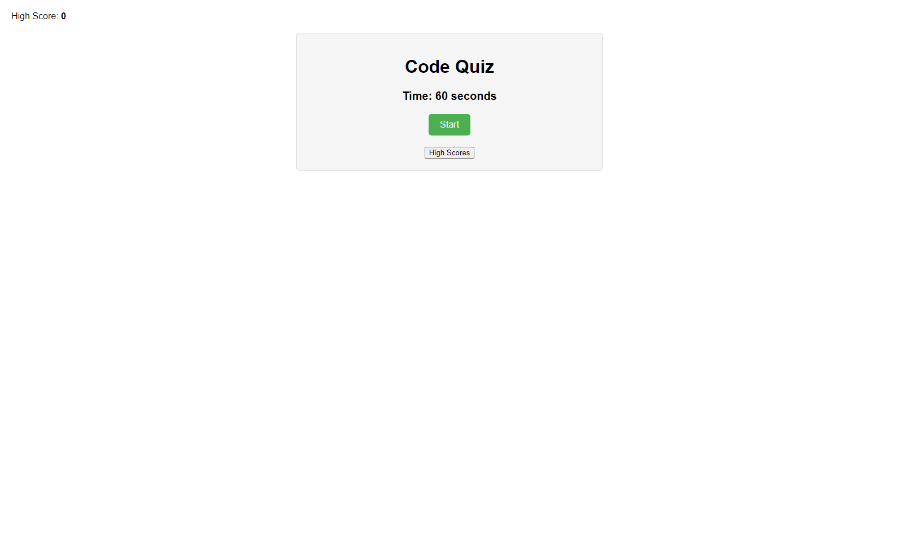
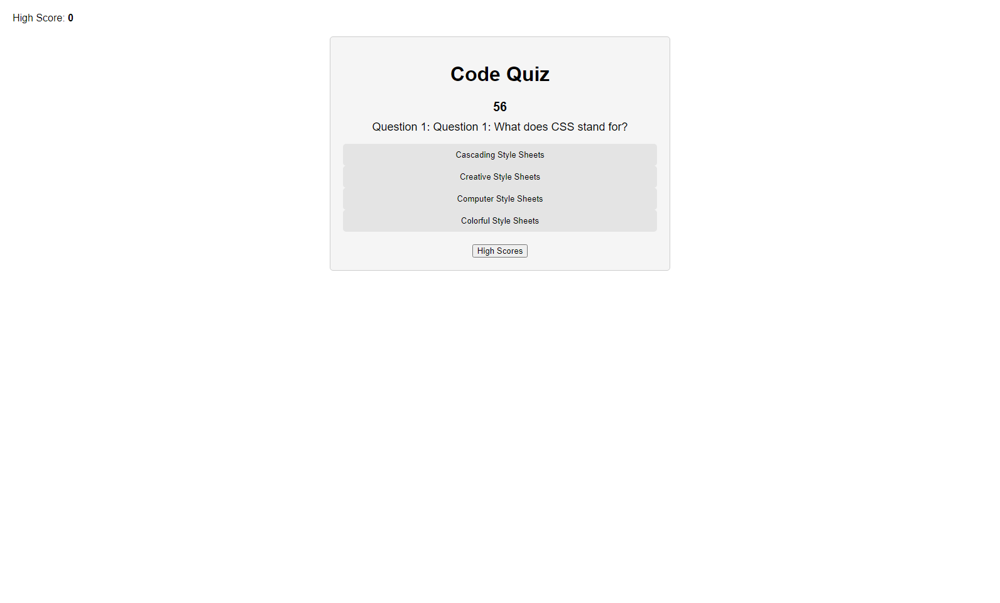
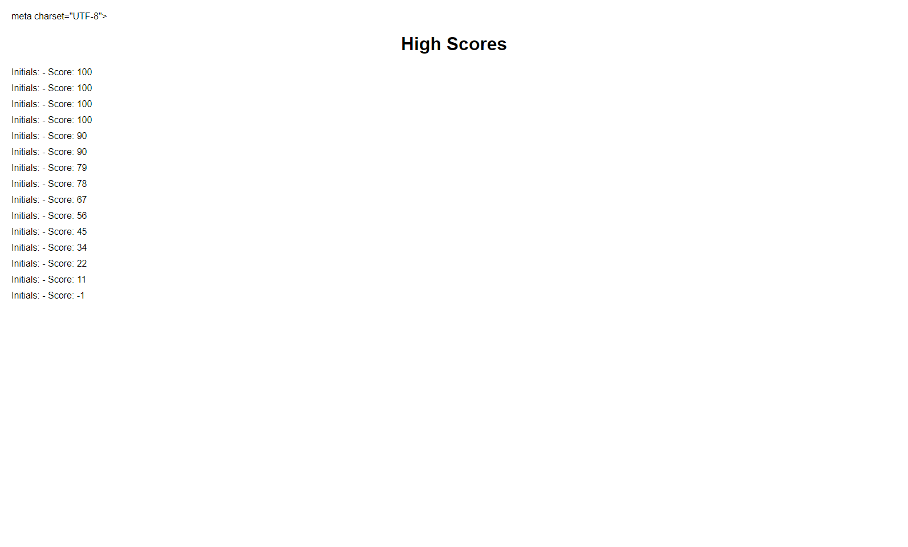

# Quiz App

The Quiz App is a web application that allows users to take a quiz and test their knowledge on various topics. It includes multiple-choice questions and a timer for each question. After completing the quiz, users can save their score and initials to see their high score and compete with others.

## Screenshots of webpage
 

## Features

- Multiple-choice questions with options
- Timer to track the remaining time for each question
- Automatic progression to the next question after selecting an answer
- Deduction of time for incorrect answers
- Saving and displaying high scores with user initials
- High scores page to view and compare scores
- Responsive design for compatibility with different devices

## Technologies Used

- HTML
- CSS
- JavaScript

## Usage

1. Clone the repository or download the source code.
2. Open the `index.html` file in a web browser.
3. Click the "Start Quiz" button to begin the quiz.
4. Read each question carefully and select an answer by clicking the corresponding option.
5. If the answer is correct, you will proceed to the next question automatically. Otherwise, time will be deducted, and the next question will be displayed.
6. After completing the quiz or when the timer runs out, you will be prompted to enter your initials.
7. Click the "Submit" button to save your score and view the high scores page.
8. On the high scores page, you can see the list of high scores achieved by different users.

## Customization

- To customize the quiz questions, open the `quizQuestions` array in the JavaScript file and modify the questions, options, and correct answers as desired.
- You can also adjust the time limit for each question by modifying the `time` variable in the JavaScript file.

## Credits

The Quiz App was created by [Your Name]. It is a project for [course or personal development]. Feel free to modify and use the code according to your needs.

## License

This project is licensed under the [MIT License](LICENSE).
